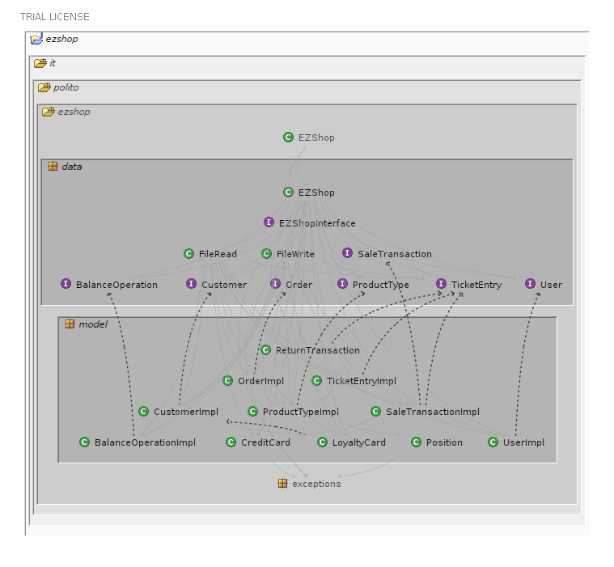
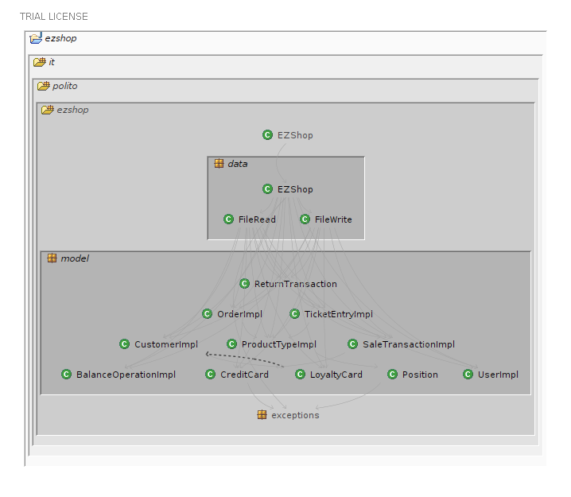
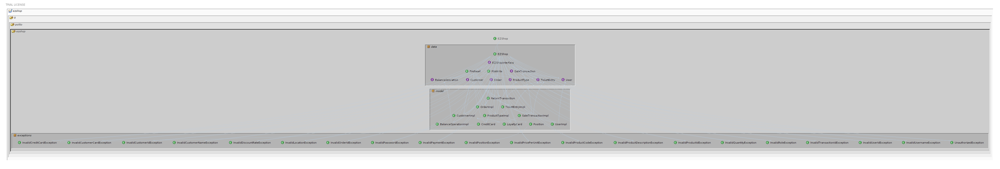
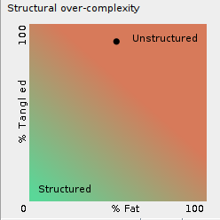
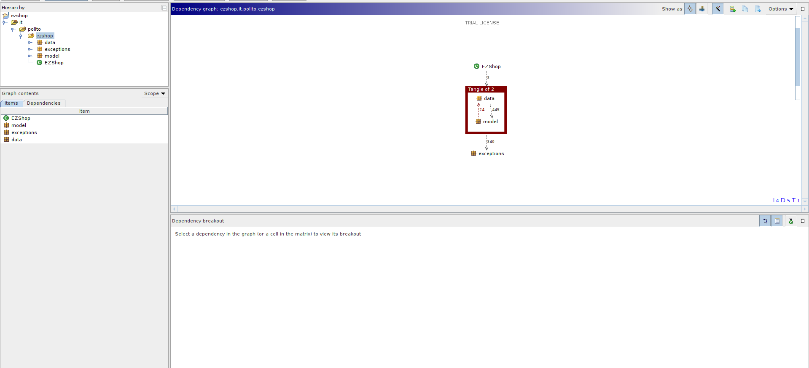
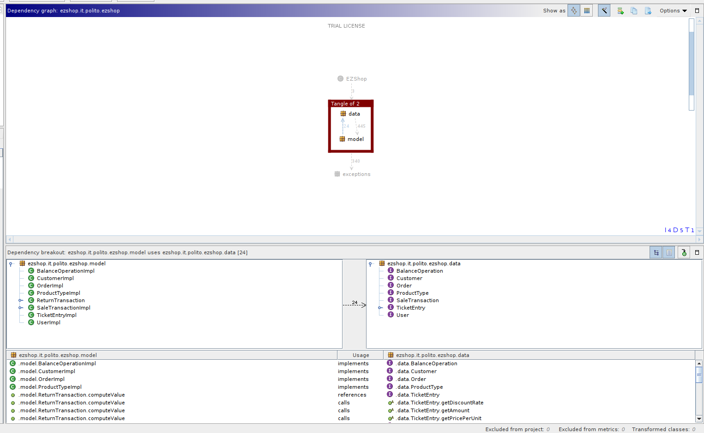
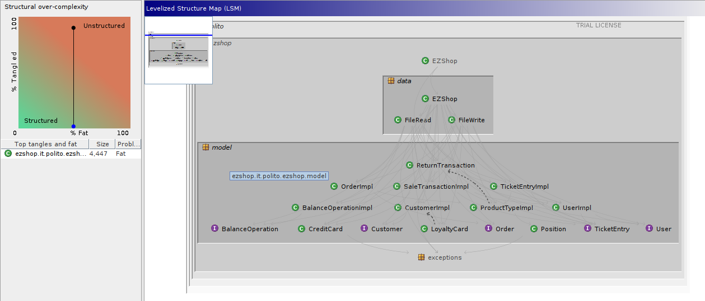
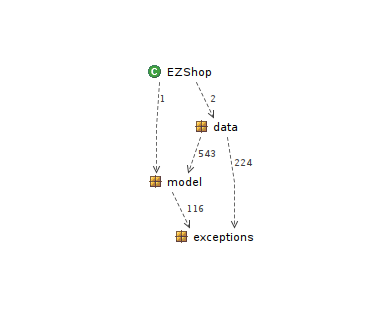

# Design assessment


```
<The goal of this document is to analyse the structure of your project, compare it with the design delivered
on April 30, discuss whether the design could be improved>
```

# Levelized structure map
```
<Applying Structure 101 to your project, version to be delivered on june 4, produce the Levelized structure map,
with all elements explosed, all dependencies, NO tangles; and report it here as a picture>
```
## LSM without showing exceptions


## LSM without showing interfaces (for readability)
)

## LSM complete with interfaces and exceptions 


# Structural over complexity chart
```
<Applying Structure 101 to your project, version to be delivered on june 4, produce the structural over complexity chart; and report it here as a picture>
```



# Size metrics

```
<Report here the metrics about the size of your project, collected using Structure 101>
```


| Metric                                    | Measure |
| ----------------------------------------- | ------- |
| Packages                                  |      6  |
| Classes (outer)                           |     43  |
| Classes (all)                             |     43  |
| NI (number of bytecode instructions)      |   8492  |
| LOC (non comment non blank lines of code) |   3652  |


# Items with XS

```
<Report here information about code tangles and fat packages>
```

| Item | Tangled | Fat  | Size | XS   |
| ---- | ------- | ---- | ---- | ---- |
| ezshop.it.polito.ezshop.data.EZShop | | 157 | 4447 | 1048 |
| ezshop.it.polito.ezshop| 3% | 5 | 8492 | 250 |
| ezshop.it.polito.ezshop.data.EZShop.deleteProductFromSale(java.lang.Integer, java.lang.String, int):boolean | | 19 | 170 | 35 |
| ezshop.it.polito.ezshop.data.EZShop.deleteReturnTransaction(java.lang.Integer):boolean | | 18 | 178 | 29 |
| ezshop.it.polito.ezshop.data.EZShop.addProductToSale(java.lang.Integer, java.lang.String, int):boolean | | 17 | 162 | 19 |
| ezshop.it.polito.ezshop.data.EZShop.receiveCreditCardPayment(java.lang.Integer, java.lang.String):boolean | | 16 | 154 | 9 |
| ezshop.it.polito.ezshop.data.EZShop.applyDiscountRateToProduct(java.lang.Integer, java.lang.String, double):boolean | | 16 | 128 | 8 |


# Package level tangles

```
<Report screen captures of the package-level tangles by opening the items in the "composition perspective" 
(double click on the tangle from the Views->Complexity page)>
```
## package-level composition view


## package-level tangles details

# Summary analysis
```
<Discuss here main differences of the current structure of your project vs the design delivered on April 30>
<Discuss if the current structure shows weaknesses that should be fixed>

The main difference between the current structure of the project and the design delivered on April 20 
is that we moved the EZShop class from the model package to the data package, in order to be compliant 
to the initial code structure that we received later on. 
For the same reason we also changed a few class names and we included the interface classes in the diagram.

One weakness of our project is the presence of tangles because the classes in the model package implement 
interfaces that are in the data package. 
To fix that we could simply move those interfaces in the model package or vice versa those classes to 
the data package.
The following screenshots show the structural over complextity chart and the package level composition view after moving those interfaces in the model package, and, as we expected, the tangles are eliminated.
```


```
A second weakness is the presence of the fat class ezshop in the model package. 
The reason for this is that inside that class we have many methods (the API methods) with many lines 
(mainly controls over input) that could be moved in lower classes methods (getters, setters, ...). 
This would be possible if we changed the signature of those methods, allowing the possibility to 
throw exceptions or return values instead of void. We could not do that, because those methods needed 
to be compliant with interfaces and we were not able to change them.

```
