# Design Document 


Authors: 

Date: 30/04/2021

Version: 1.0.0


# Contents

- [High level design](#package-diagram)
- [Low level design](#class-diagram)
- [Verification traceability matrix](#verification-traceability-matrix)
- [Verification sequence diagrams](#verification-sequence-diagrams)

# Instructions

The design must satisfy the Official Requirements document, notably functional and non functional requirements

# High level design 

ARCHITECTURAL PATTERNS:
We used a 3 layer architecture: we have the GUI, the application logic and the data layer.
We also used MVC pattern, which model part is implemented in data and model packages, while the view and the controller are implemented externally by the GUI and the API.

DESIGN PATTERNS:
EZShop is a Facade, and implements the interface EZShopInterface.
For Drivers and Payment API we have an intermediate class, which is an adaptar for them. In our simplified version we don't need to manage hardware, so we didn't implement them.

DATA PERSISTENCE:
When the application starts, it reads all the files to load the data in the maps.
Each time a map is updated (ex: add a user, delete a user, ...), the application writes back the data to the file.
FileRead and FileWrite classes manage the reading and the writing from and to the actual files, and expose the methods to do that.

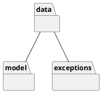

# Low level design


# Verification traceability matrix

| | Admin | EZShopInterface | EZShop | User | Customer | LoyaltyCard | BalanceOperation | ReturnTransaction | SaleTransaction | Order | TransactionProduct | ProductType | Position | CreditCard |FileWrite | FileRead |
|--- |:---:|:---:|:---:|:---:|:---:|:---:|:---:|:---:|:---:|:---:|:---:|:---:|:---:|:---:|:---:|:---:|
|FR1 | X | | X | | | | | | | | | X | X | X | |
|FR3 | X | | X | | X | | | | | | | | | X | |
|FR4 | | | | | | | | | | | | | | | |
|FR5 | | | | | | | | | | | | | | | |
|FR6 | | | | | | | | | | | | | | | |
|FR7 | | | | | | | | | | | | | | | |
|FR8 | | | | | | | | | | | | | | | |


# Verification sequence diagrams 

## Scenario 1.1 - Create product type X
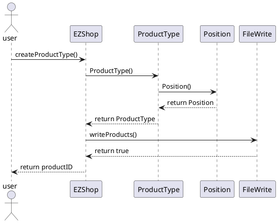

## Scenario 1.2 - Modify product type location
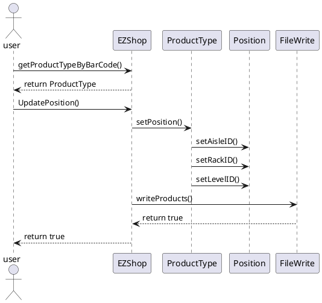

## Scenario 1.3 - Modify product type price per unit
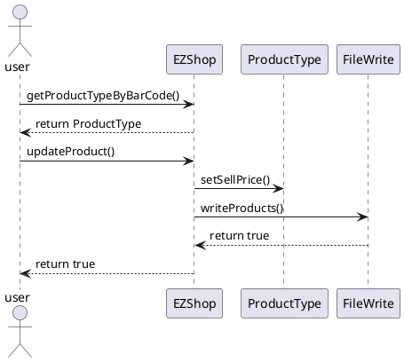

## Scenario 2.1 - Create user and define rights
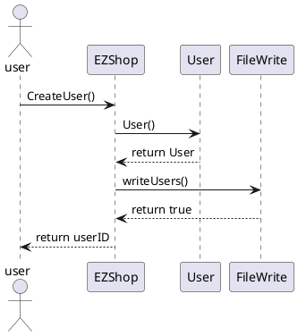

## Scenario 2.2 - Delete user
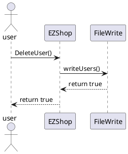

## Scenario 2.3 - Modify user rights
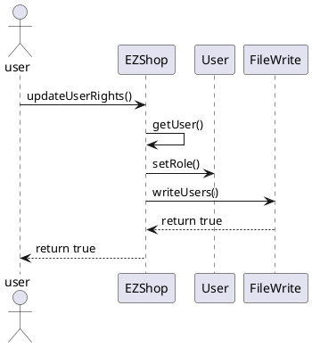

## Scenario 3.1 - Order of product type X issued
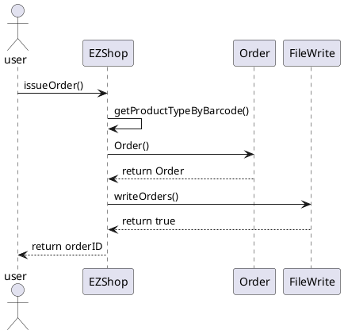

## Scenario 3.2 - Order of product type X payed
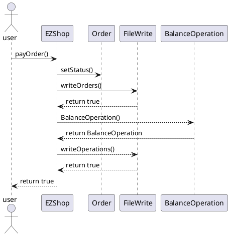

## Scenario 3.3 - Record order of product type X arrival
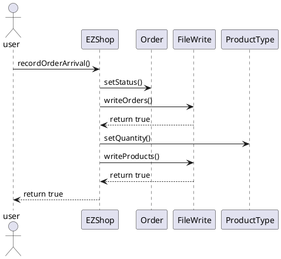

## Scenario 4.1 - Create customer record
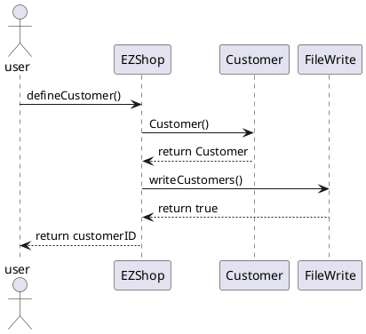

## Scenario 4.2 - Attach Loyalty card to customer record
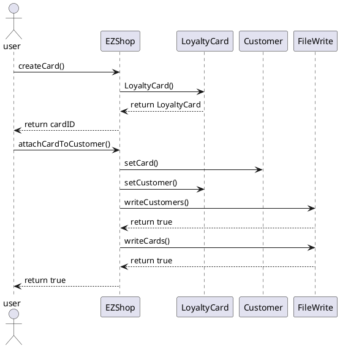

## Scenario 4.3 - Detach Loyalty card from customer record
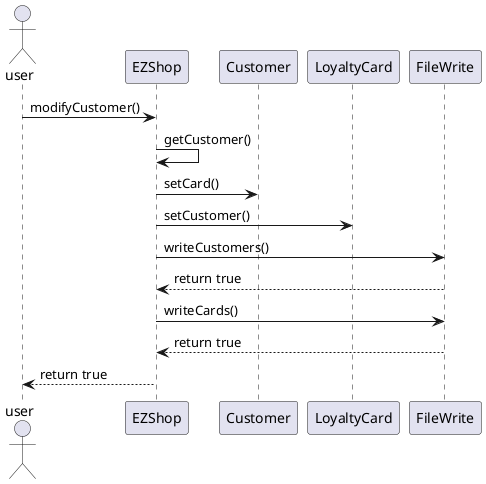

## Scenario 4.4 - Update Customer record
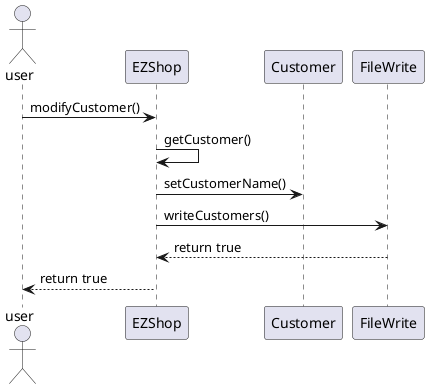

## Scenario 5.1 - Login

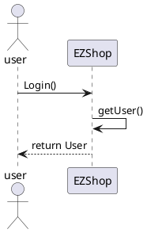

## Scenario 5.2 - Logout

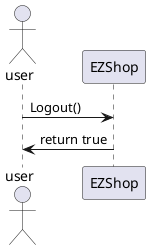

## Scenario 6.1 - Sale of product type X completed (Credit Card)
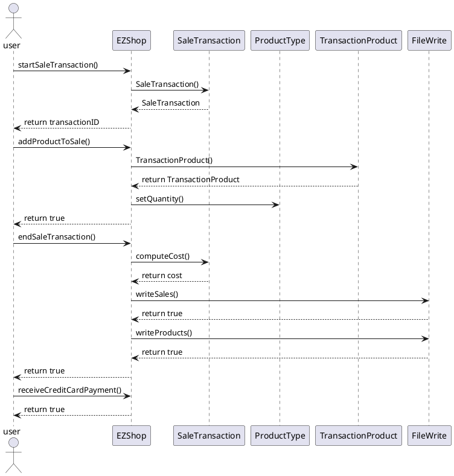

## Scenario 6.2 - Sale of product type X with product discount
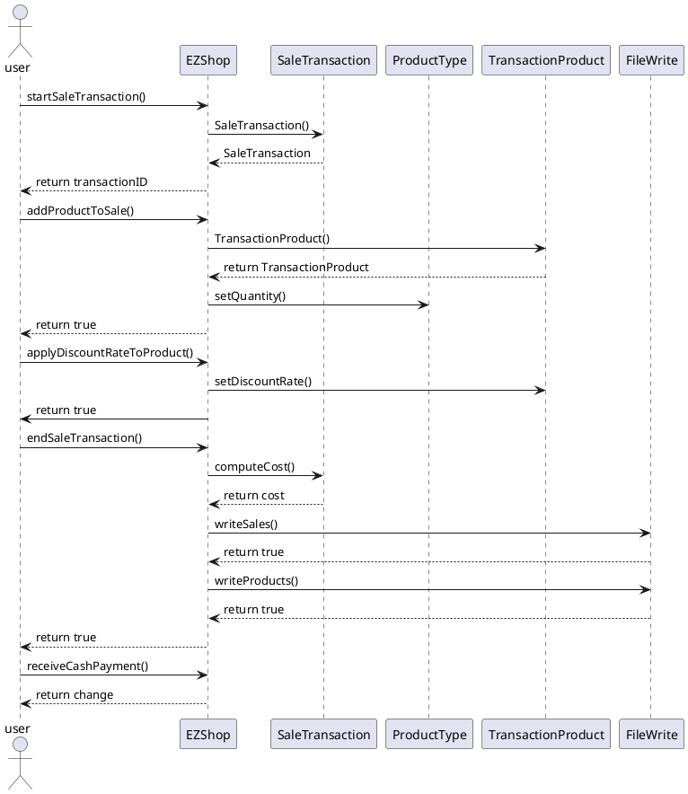

## Scenario 6.3 - Sale of product type X with sale discount
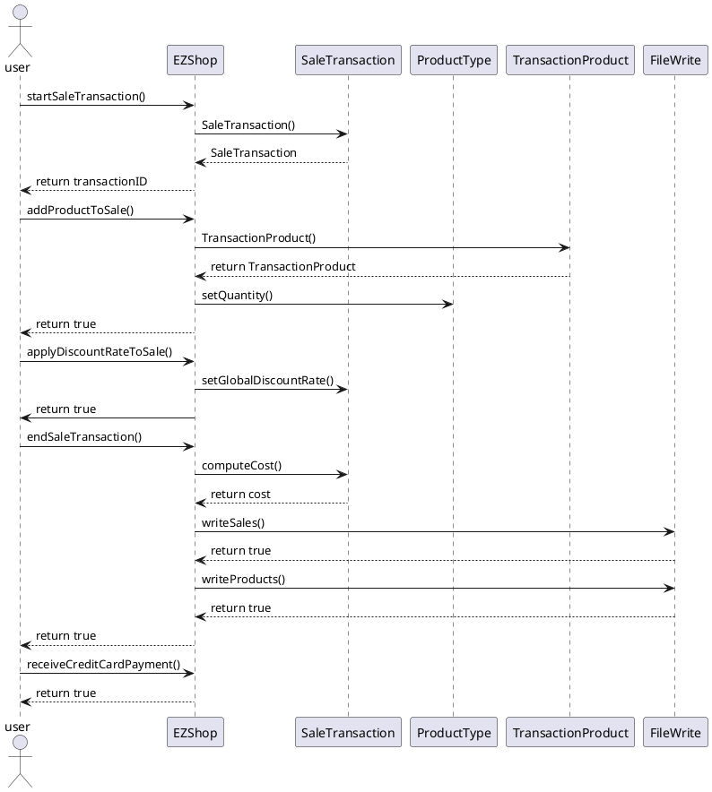

## Scenario 6.4 - Sale of product type X with Loyalty Card update
```plantuml
@startuml
actor user
participant EZShop
participant SaleTransaction
participant ProductType
participant TransactionProduct
participant Customer
user -> EZShop : startSaleTransaction()
EZShop -> SaleTransaction : SaleTransaction()
EZShop <-- SaleTransaction : SaleTransaction
user <-- EZShop : return transactionID
user -> EZShop : addProductToSale()
EZShop -> TransactionProduct : TransactionProduct()
EZShop <-- TransactionProduct : return TransactionProduct
EZShop -> ProductType : setQuantity()
user <-- EZShop : return true
user -> EZShop : endSaleTransaction()
EZShop -> SaleTransaction : computeCost()
EZShop <-- SaleTransaction : return cost
EZShop -> FileWrite : writeSales()
EZShop <-- FileWrite : return true
EZShop -> FileWrite : writeProducts()
EZShop <-- FileWrite : return true
user <-- EZShop : return true
user -> EZShop : receiveCreditCardPayment()
user <-- EZShop : return true
user -> EZShop : modifyPointsOnCard()
EZShop -> LoyaltyCard: setPoints()
EZShop -> FileWrite : writeCards()
user <-- EZShop : return true
@enduml
```

## Scenario 6.5 - Sale of product type X cancelled
```plantuml
@startuml
actor user
participant EZShop
participant SaleTransaction
participant ProductType
participant TransactionProduct
user -> EZShop : startSaleTransaction()
EZShop -> SaleTransaction : SaleTransaction()
EZShop <-- SaleTransaction : SaleTransaction
user <-- EZShop : return transactionID
user -> EZShop : addProductToSale()
EZShop -> TransactionProduct : TransactionProduct()
EZShop <-- TransactionProduct : return TransactionProduct
EZShop -> ProductType : setQuantity()
user <-- EZShop : return true
user -> EZShop : endSaleTransaction()
EZShop -> SaleTransaction : computeCost()
EZShop <-- SaleTransaction : return cost
EZShop -> FileWrite : writeSales()
EZShop <-- FileWrite : return true
EZShop -> FileWrite : writeProducts()
EZShop <-- FileWrite : return true
user <-- EZShop : return true
user -> EZShop : deleteSaleTransaction()
EZShop -> EZShop : getSaleTransaction()
EZShop -> ProductType : setQuantity()
EZShop -> FileWrite : writeProducts()
EZShop <-- FileWrite : return true
EZShop -> FileWrite : writeSales()
EZShop <-- FileWrite : return true
user <-- EZShop : return true
@enduml
```

## Scenario 6.6 - Sale of product type X completed (Cash)
```plantuml
@startuml
actor user
participant EZShop
participant SaleTransaction
participant ProductType
participant TransactionProduct
user -> EZShop : startSaleTransaction()
EZShop -> SaleTransaction : SaleTransaction()
EZShop <-- SaleTransaction : SaleTransaction
user <-- EZShop : return transactionID
user -> EZShop : addProductToSale()
EZShop -> TransactionProduct : TransactionProduct()
EZShop <-- TransactionProduct : return TransactionProduct
EZShop -> ProductType : setQuantity()
user <-- EZShop : return true
user -> EZShop : endSaleTransaction()
EZShop -> SaleTransaction : computeCost()
EZShop <-- SaleTransaction : return cost
EZShop -> FileWrite : writeSales()
EZShop <-- FileWrite : return true
EZShop -> FileWrite : writeProducts()
EZShop <-- FileWrite : return true
user <-- EZShop : return true
user -> EZShop : receiveCashPayment()
user <-- EZShop : return change
@enduml
```

## Scenario 7.1 - Manage payment by valid credit card
```plantuml
@startuml
actor user
participant EZShop
participant CreditCard
participant SaleTransaction
participant BalanceOperation
user -> EZShop : receiveCreditCardPayment()
EZShop -> FileRead : readCreditCards()
EZShop <-- FileRead : List<CreditCards>
EZShop -> CreditCard : checkValidity()
EZShop <-- CreditCard : true
EZShop -> CreditCard : getBalance()
EZShop <-- CreditCard : balance
EZShop -> CreditCard : setBalance()
EZShop -> SaleTransaction : setCreditCard()
EZShop -> SaleTransaction : setState()
EZShop -> SaleTransaction : setPaymentType()
EZShop -> SaleTransaction : getCost()
EZShop <-- SaleTransaction : cost
EZShop -> FileWrite : writeSales()
EZShop <-- FileWrite : return true
EZShop -> BalanceOperation : BalanceOperation()
EZShop <-- BalanceOperation : return BalanceOperation
EZShop -> FileWrite : writeOperations()
EZShop <-- FileWrite : return true
EZShop -> FileRead : writeCreditCards()
EZShop <-- FileRead : true
user <-- EZShop : return true
@enduml
```


## Scenario 7.4 - Manage cash payment
```plantuml
@startuml
actor user
participant EZShop
participant SaleTransaction
participant BalanceOperation
user -> EZShop : receiveCashPayment()
EZShop -> SaleTransaction : setState()
EZShop -> SaleTransaction : setPaymentType()
EZShop -> SaleTransaction : getCost()
EZShop <-- SaleTransaction : cost
EZShop -> FileWrite : writeSales()
EZShop <-- FileWrite : return true
EZShop -> BalanceOperation : BalanceOperation()
EZShop <-- BalanceOperation : return BalanceOperation
EZShop -> FileWrite : writeOperations()
EZShop <-- FileWrite : return true
user <-- EZShop : return change
@enduml
```

## Scenario 8.1 - Return transaction of product type X completed, credit card
```plantuml
@startuml
actor user
participant EZShop
participant SaleTransaction
participant ProductType
participant TransactionProduct
participant ReturnTransaction
user -> EZShop : startReturnTransaction()
EZShop -> ReturnTransaction : ReturnTransaction()
EZShop <-- ReturnTransaction : ReturnTransaction
user <-- EZShop : return transactionID
user -> EZShop : returnProduct()
EZShop -> SaleTransaction : getProducts()
EZShop <-- SaleTransaction : List<TransactionProduct>
EZShop -> TransactionProduct : getQuantity()
EZShop <-- TransactionProduct : return quantity
user <-- EZShop : return true
user -> EZShop : endReturnTransaction()
EZShop -> ProductType : setQuantity()
EZShop -> SaleTransaction : setProducts()
EZShop -> SaleTransaction : computeCost()
EZShop <-- SaleTransaction : return cost
EZShop -> FileWrite : writeSales()
EZShop <-- FileWrite : return true
EZShop -> FileWrite : writeProducts()
EZShop <-- FileWrite : return true
EZShop -> FileWrite : writeReturns()
EZShop <-- FileWrite : return true
user <-- EZShop : return true
user -> EZShop : returnCreditCardPayment()
user <-- EZShop : return true
@enduml
```

## Scenario 9.1 - List credits and debits
```plantuml
@startuml
actor user
participant EZShop
user -> EZShop : getCreditsAndDebits()
user <-- EZShop : return List<BalanceOperation>
@enduml
```

## Scenario 10.1 - Manage return 
```plantuml
@startuml
actor user
participant EZShop
participant CreditCard
participant ReturnTransaction
participant BalanceOperation
user -> EZShop : returnCreditCardPayment()
EZShop -> FileRead : readCreditCards()
EZShop <-- FileRead : List<CreditCards>
EZShop -> CreditCard : checkValidity()
EZShop <-- CreditCard : true
EZShop -> ReturnTransaction : computeValue()
EZShop <-- ReturnTransaction : return amount
EZShop -> CreditCard : getBalance()
EZShop <-- CreditCard : Double
EZShop -> CreditCard : setBalance()
EZShop -> ReturnTransaction : setState()
EZShop --> BalanceOperation : BalanceOperation()
EZShop <-- BalanceOperation : return BalanceOperation
EZShop --> FileWrite : writeOperations()
EZShop <-- FileWrite : return true
EZShop -> FileWrite : writeCreditCards()
EZShop <-- FileWrite : true
EZShop -> FileWrite : writeReturns()
EZShop <-- FileWrite : true
user <-- EZShop : return true
@enduml
```


```

