# Design Document 


Authors: 

Date:

Version:


# Contents

- [High level design](#package-diagram)
- [Low level design](#class-diagram)
- [Verification traceability matrix](#verification-traceability-matrix)
- [Verification sequence diagrams](#verification-sequence-diagrams)

# Instructions

The design must satisfy the Official Requirements document, notably functional and non functional requirements

# High level design 

<discuss architectural styles used, if any>
<report package diagram>

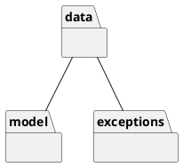

# Low level design

<for each package, report class diagram>

```plantuml
@startuml
top to bottom direction

package data {
    Class EZShopInterface{}
    Class FileRead{
        +readUsers(String fileName) : Map<Integer,User>
        +readProducts(String fileName) : Map<Integer,ProductType>
        +readOrders(String fileName) : Map<Integer,Order>
        +readCustomers(String fileName) : Map<Integer,Customer>
        +readCards(String fileName) : Map<String,LoyaltyCard>
        +readSales(String fileName) : Map<Integer,SaleTransaction>
        +readReturns(String fileName) : Map<Integer,ReturnTransaction>
        +readOperations(String fileName) : Map<Integer,BalanceOperation>
        +readCreditCards(String fileName) : List<CreditCard>
        
    }
    Class FileWrite{
        +writeUsers(String fileName, Map<Integer,User>) : boolean
        +writeProducts(String fileName, Map<Integer,ProductType>) : boolean
        +writeOrders(String fileName, Map<Integer,Order>) : boolean
        +writeCustomers(String fileName, Map<Integer,Customer>) : boolean
        +writeCards(String fileName, Map<String,LoyaltyCard>) : boolean
        +writeSales(String fileName, Map<Integer,SaleTransaction>) : boolean
        +writeReturns(String fileName, Map<Integer,ReturnTransaction>) : boolean
        +writeOperations(String fileName, Map<Integer,BalanceOperation>) : boolean
        +writeCreditCards(String fileName, List<CreditCard>) : boolean
    }
}
package model {
Class EZShop{
    +users : Map<Integer,User>
    +products : Map<Integer,ProductType>
    +orders : Map<Integer,Order>
    +customers : Map<Integer,Customer>
    +cards : Map<String,LoyaltyCard>
    +sales : Map<Integer,SaleTransaction>
    +returns : Map<Integer,ReturnTransaction>
    +operations : Map<Integer,BalanceOperation>
    +loggedInUser : User
    
    +reset() : void
    +createUser(String username, String password, String role) : Integer
    +deleteUser(Integer id) : boolean
    +getAllUser() : List<User>
    +getUser(Integer id) : User
    +updateUserRights(Integer id, String role) : boolean
    +login(String username, String password) : User
    +logout() : boolean
    +createProductType(String description, String productCode, double pricePerUnit, String note) : Integer
    +updateProduct(Integer id, String newDescription, String newCode, double newPrice, String newNote) : boolean
    +deleteProductType(Integer id) : boolean
    +getAllProductTypes() : List<ProductType>
    +getProductTypeByBarCode(String barcode) : ProductType
    +getProductTypesByDescription(String description) : List<ProductType> 
    +updateQuantity(Integer productId, int toBeAdded) : boolean
    +updatePosition(Integer productId, String newPos) : boolean
    +issueOrder(String productCode, int quantity, double pricePerUnit) : Integer
    +payOrderFor(String productCode, int quantity, double pricePerUnit) : Integer
    +payOrder(Integer orderId) : boolean
    +recordOrderArrival(Integer orderId) : boolean
    +getAllOrders() : List<Order>
    +defineCustomer(String customerName) : Integer
    +modifyCustomer(Integer id, String newCustomerName, String newCustomerCard) : boolean
    +deleteCustomer(Integer id) : boolean
    +getCustomer(Integer id) : Customer
    +getAllCustomers() : List<Customer>
    +createCard() : String
    +attachCardToCustomer(String customerCard, Integer customerId) : boolean
    +modifyPointsOnCard(String customerCard, int pointsToBeAdded) : boolean
    +startSaleTransaction() : Integer
    +addProductToSale(Integer transactionId, String productCode, int amount) : boolean
    +deleteProductFromSale(Integer transactionId, String productCode, int amount) : boolean
    +applyDiscountRateToProduct(Integer transactionId, String productCode, double discountRate) : boolean
    +applyDiscountRateToSale(Integer transactionId, double discountRate) : boolean
    +computePointsForSale(Integer transactionId) : int
    +endSaleTransaction(Integer transactionId) : boolean
    +deleteSaleTransaction(Integer transactionId) : boolean
    +getSaleTransaction(Integer transactionId) : SaleTransaction
    +startReturnTransaction(Integer transactionId) : Integer
    +returnProduct(Integer returnId, String productCode, int amount) : boolean
    +endReturnTransaction(Integer returnId, boolean commit) : boolean
    +deleteReturnTransaction(Integer returnId) : boolean
    +receiveCashPayment(Integer transactionId, double cash) : double
    +receiveCreditCardPayment(Integer transactionId, String creditCard) : boolean
    +returnCashPayment(Integer returnId) : double
    +returnCreditCardPayment(Integer returnId, String creditCard) : double
    +recordBalanceUpdate(double toBeAdded) : boolean
    +getCreditsAndDebits(LocalDate from, LocalDate to) : List<BalanceOperation>
    +computeBalance() : double
}

Class User {
    -username : String
    -password : String
    -role : String
    -ID : Integer
}


class ProductType{
    -productCode : String
    -description : String
    -sellPrice : Double
    -notes : String
    -ID : Integer
    -quantity : Integer
    -position : Position
}

class Position{
    -aisleID : String
    -rackID : String
    -levelID : String
    +Position(String aisleID, String rackID, String levelID)
    +Position(String position)
}
class Order {
    -orderID : Integer
    -pricePerUnit : Double
    -quantity : Integer
    -productID : String
    -status : String
}

class Customer{
    -customerName : String
    -customerID : Integer
    -card : LoyaltyCard
}

class LoyaltyCard{
    -cardID : String
    -points : Integer
    -customer : Customer
}

class SaleTransaction {
    -transactionID : Integer
    -products : List<TransactionProduct>
    -globalDiscountRate : Double
    -state : String
    -date : LocalDate
    -time : String
    -cost : Double
    -paymentType : String
    -creditCard : CreditCard
    +computeCost() : Double
}

class TransactionProduct{
    -productCode : ProductType
    -quantity : Integer
    -discountRate : Double
}

class ReturnTransaction{
    -returnID : Integer
    -transaction : SaleTransaction
    -products : List<TransactionProduct>
    -state : String
    -commit : boolean
    -value : Double
    +computeValue() : Double
}

class BalanceOperation{
    -balanceId : Integer
    -type : String
    -amount : Double
    -date : LocalDate
}

class CreditCard{
    -number : String
    -balance : Double
    +checkValidity() : boolean
}

EZShop --> "*" User
EZShop --> "*" ProductType
EZShop --> "*" Order
EZShop --> "*" Customer
EZShop --> "*" LoyaltyCard
EZShop --> "*" BalanceOperation
EZShop --> "*" CreditCard
EZShop --> "*" SaleTransaction
EZShop --> "*" ReturnTransaction

ProductType -- Order
ProductType -- TransactionProduct
ProductType -- Position
Customer -- LoyaltyCard
TransactionProduct "*" -- SaleTransaction
TransactionProduct "*" -- ReturnTransaction
ReturnTransaction -- SaleTransaction
BalanceOperation -- Order
BalanceOperation -- ReturnTransaction
BalanceOperation -- SaleTransaction
CreditCard -- SaleTransaction
EZShopInterface <|-- EZShop
FileRead <-- EZShop
FileWrite <-- EZShop
}
@enduml
```


# Verification traceability matrix

\<for each functional requirement from the requirement document, list which classes concur to implement it>

| | Admin | EZShopInterface | EZShop | User | Customer | LoyaltyCard | BalanceOperation | ReturnTransaction | SaleTransaction | Order | TransactionProduct | ProductType | Position |JSONwrite | JSONread |
|--- |:---:|:---:|:---:|:---:|:---:|:---:|:---:|:---:|:---:|:---:|:---:|:---:|:---:|:---:|:---:|
|FR1 | X | | X | | | | | | | | | X | X | X | |
|FR3 | X | | X | | X | | | | | | | | | X | |
|FR4 | | | | | | | | | | | | | | | |
|FR5 | | | | | | | | | | | | | | | |
|FR6 | | | | | | | | | | | | | | | |
|FR7 | | | | | | | | | | | | | | | |
|FR8 | | | | | | | | | | | | | | | |


# Verification sequence diagrams 
\<select key scenarios from the requirement document. For each of them define a sequence diagram showing that the scenario can be implemented by the classes and methods in the design>

## Scenario 1.1 - Create product type X
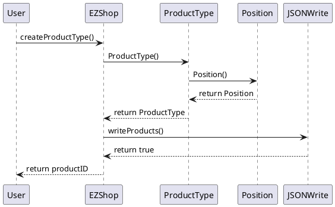

## Scenario 1.2 - Modify product type location
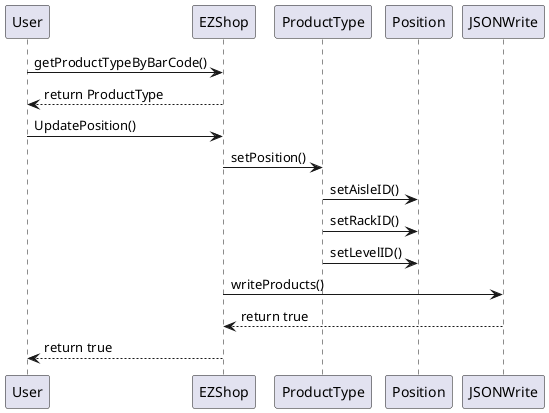

## Scenario 1.3 - Modify product type price per unit
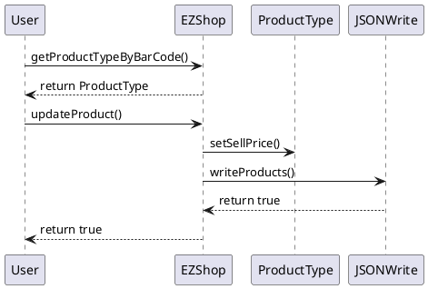

## Scenario 2.1 - Create user and define rights
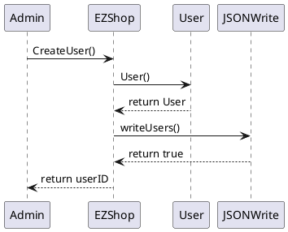

## Scenario 2.2 - Delete user
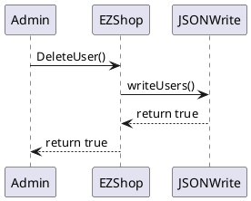

## Scenario 2.3 - Modify user rights
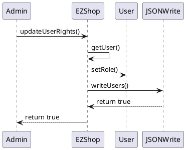

## Scenario 3.1 - Order of product type X issued
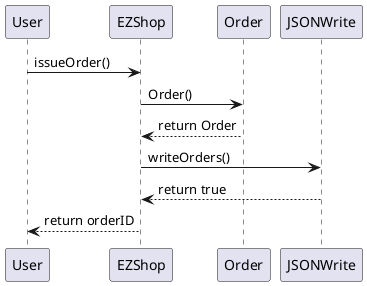

## Scenario 3.2 - Order of product type X payed
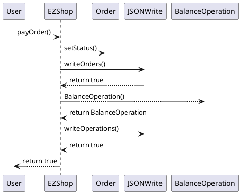

## Scenario 3.3 - Record order of product type X arrival
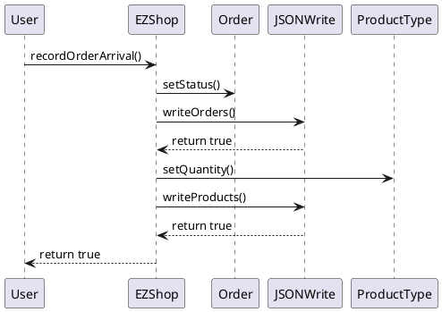

## Scenario 4.1 - Create customer record
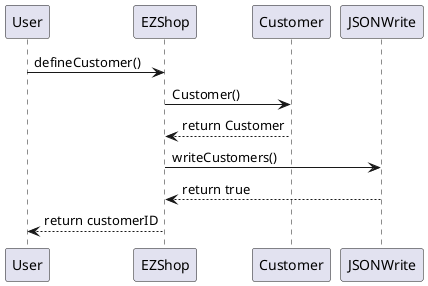

## Scenario 4.2 - Attach Loyalty card to customer record
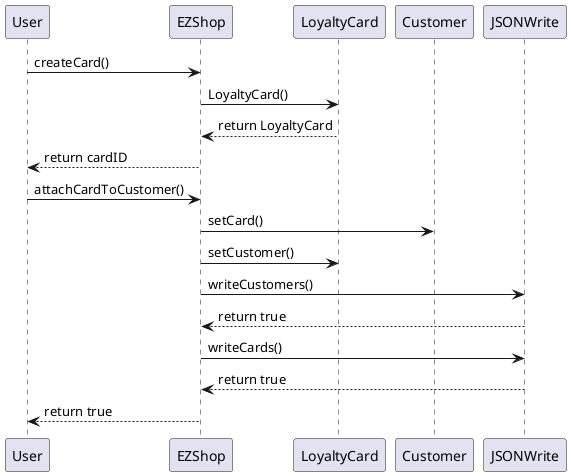

## Scenario 4.3 - Detach Loyalty card from customer record
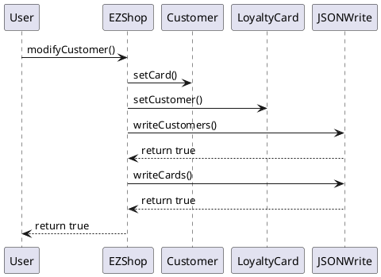

## Scenario 4.4 - Update Customer record
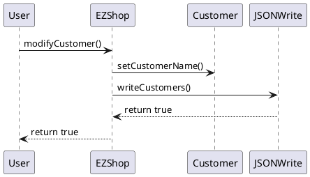

## Scenario 5.1 - Login

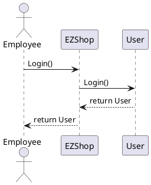

## Scenario 5.2 - Logout

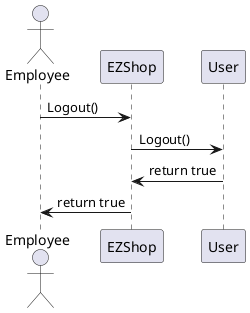

## Scenario 6.1 - Sale of product type X completed (Credit Card)
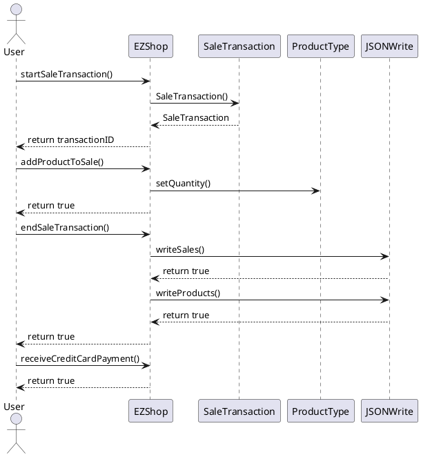

## Scenario 6.2 - Sale of product type X with product discount
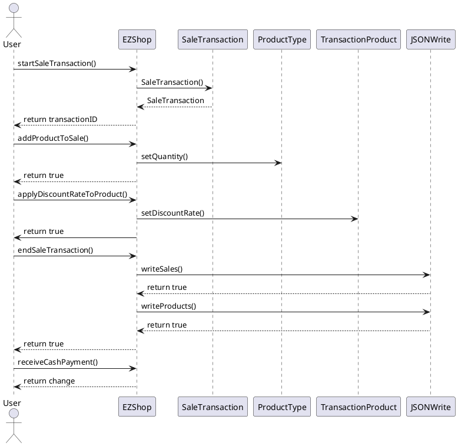

## Scenario 6.3 - Sale of product type X with sale discount
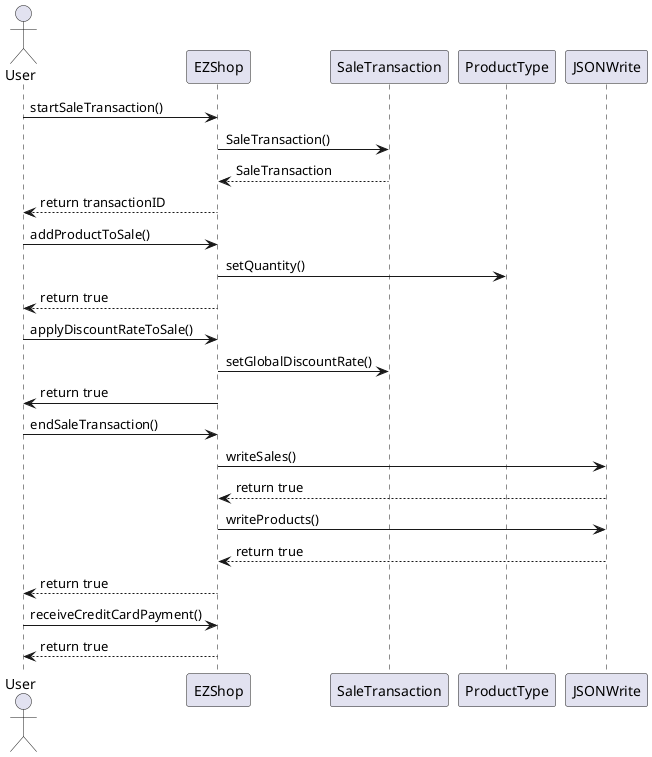

## Scenario 6.4 - Sale of product type X with Loyalty Card update
```plantuml
@startuml
actor User
participant EZShop
participant SaleTransaction
participant ProductType
participant Customer
User -> EZShop : startSaleTransaction()
EZShop -> SaleTransaction : SaleTransaction()
EZShop <-- SaleTransaction : SaleTransaction
User <-- EZShop : return transactionID
User -> EZShop : addProductToSale()
EZShop -> ProductType : setQuantity()
User <-- EZShop : return true
User -> EZShop : endSaleTransaction()
EZShop -> JSONWrite : writeSales()
EZShop <-- JSONWrite : return true
EZShop -> JSONWrite : writeProducts()
EZShop <-- JSONWrite : return true
User <-- EZShop : return true
User -> EZShop : getCustomer()
EZShop -> Customer : getCustomer()
EZShop <-- Customer : return Customer
User <-- EZShop : return Customer
User -> EZShop : receiveCreditCardPayment()
User <-- EZShop : return true
User -> EZShop : modifyPointsOnCard()
EZShop -> LoyaltyCard: setPoints()
User <-- EZShop : return true
@enduml
```

## Scenario 6.5 - Sale of product type X cancelled
```plantuml
@startuml
actor User
participant EZShop
participant SaleTransaction
participant ProductType
User -> EZShop : startSaleTransaction()
EZShop -> SaleTransaction : SaleTransaction()
EZShop <-- SaleTransaction : SaleTransaction
User <-- EZShop : return transactionID
User -> EZShop : addProductToSale()
EZShop -> ProductType : setQuantity()
User <-- EZShop : return true
User -> EZShop : endSaleTransaction()
EZShop -> JSONWrite : writeSales()
EZShop <-- JSONWrite : return true
EZShop -> JSONWrite : writeProducts()
EZShop <-- JSONWrite : return true
User <-- EZShop : return true
User -> EZShop : getSaleTransaction()
EZShop -> SaleTransaction: getSaleTransaction()
EZShop <-- SaleTransaction: return Transaction
User <-- EZShop : return Transaction
User -> EZShop: deleteProductFromSale()
EZShop -> ProductType : setQuantity()
EZShop -> JSONWrite : writeProducts()
EZShop <-- JSONWrite : return true
User <-- EZShop : return true
User -> EZShop : deleteSaleTransaction()
EZShop -> JSONRead : readSales()
EZShop <- JSONRead : return List<SaleTransaction>
EZShop -> JSONWrite : writeSales()
User <-- EZShop : return true
@enduml
```

## Scenario 6.6 - Sale of product type X completed (Cash)
```plantuml
@startuml
actor User
participant EZShop
participant SaleTransaction
participant ProductType
User -> EZShop : startSaleTransaction()
EZShop -> SaleTransaction : SaleTransaction()
EZShop <-- SaleTransaction : SaleTransaction
User <-- EZShop : return transactionID
User -> EZShop : addProductToSale()
EZShop -> ProductType : setQuantity()
User <-- EZShop : return true
User -> EZShop : endSaleTransaction()
EZShop -> JSONWrite : writeSales()
EZShop <-- JSONWrite : return true
EZShop -> JSONWrite : writeProducts()
EZShop <-- JSONWrite : return true
User <-- EZShop : return true
User -> EZShop : receiveCashPayment()
User <-- EZShop : return change
@enduml
```

## Scenario 7.1 - Manage payment by valid credit card
```plantuml
@startuml
actor User
participant EZShop
participant CreditCard
participant SaleTransaction
participant BalanceOperation
User -> EZShop : receiveCreditCardPayment()
EZShop -> JSONRead : readCreditCards()
EZShop <-- JSONRead : List<CreditCards>
EZShop -> CreditCard : checkValidity()
EZShop <-- CreditCard : true
EZShop -> CreditCard : getBalance()
EZShop <-- CreditCard : Double
EZShop -> CreditCard : setBalance()
EZShop -> SaleTransaction : setCreditCard()
EZShop -> SaleTransaction : setState()
EZShop -> SaleTransaction : setPaymentType()
EZShop -> SaleTransaction : getCost()
EZShop <- SaleTransaction : Double
EZShop --> JSONWrite : writeSales()
EZShop <-- JSONWrite : return true
EZShop --> BalanceOperation : BalanceOperation()
EZShop <-- BalanceOperation : return BalanceOperation
EZShop --> JSONWrite : writeOperations()
EZShop <-- JSONWrite : return true
EZShop -> JSONRead : writeCreditCards()
EZShop <-- JSONRead : true
User <-- EZShop : return true
@enduml
```


## Scenario 7.4 - Manage cash payment
```plantuml
@startuml
actor User
participant EZShop
participant SaleTransaction
participant BalanceOperation
User -> EZShop : receiveCashPayment()
EZShop -> SaleTransaction : setState()
EZShop -> SaleTransaction : setPaymentType()
EZShop -> SaleTransaction : getCost()
EZShop <- SaleTransaction : Double
EZShop --> JSONWrite : writeSales()
EZShop <-- JSONWrite : return true
EZShop --> BalanceOperation : BalanceOperation()
EZShop <-- BalanceOperation : return BalanceOperation
EZShop --> JSONWrite : writeOperations()
EZShop <-- JSONWrite : return true
User <-- EZShop : return Double
@enduml
```

## Scenario 8.1 - Return transaction of product type X completed, credit card
```plantuml
@startuml
actor User
participant EZShop
participant SaleTransaction
participant ProductType
participant TransactionProduct
participant ReturnTransaction
User -> EZShop : startReturnTransaction()
EZShop -> ReturnTransaction : ReturnTransaction()
EZShop <-- ReturnTransaction : ReturnTransaction
User <-- EZShop : return transactionID
User -> EZShop : returnProduct()
EZShop -> SaleTransaction : getProducts()
EZShop <-- SaleTransaction : List<TransactionProduct>
EZShop -> TransactionProduct : getQuantity()
EZShop <-- TransactionProduct : return quantity
User -> EZShop : endReturnTransaction()
EZShop -> ProductType : setQuantity()
EZShop -> SaleTransaction : setProducts()
User -> EZShop : returnCreditCardPayment()
User <-- EZShop : return true
EZShop -> JSONWrite : writeSales()
EZShop <-- JSONWrite : return true
EZShop -> JSONWrite : writeProducts()
EZShop <-- JSONWrite : return true
EZShop -> JSONWrite : writeReturns()
EZShop <-- JSONWrite : return true
User <-- EZShop : return true
@enduml
```

## Scenario 9.1 - List credits and debits
```plantuml
@startuml
actor User
participant EZShop
User -> EZShop : getCreditsAndDebits()
User <-- EZShop : return List<BalanceOperation>
@enduml
```

## Scenario 10.1 - Manage return 
```plantuml
@startuml
actor User
participant EZShop
participant CreditCard
participant ReturnTransaction
participant BalanceOperation
User -> EZShop : returnCreditCardPayment()
EZShop -> JSONRead : readCreditCards()
EZShop <-- JSONRead : List<CreditCards>
EZShop -> CreditCard : checkValidity()
EZShop <-- CreditCard : true
EZShop -> ReturnTransaction : computeValue()
EZShop <-- ReturnTransaction : return amount
EZShop -> CreditCard : getBalance()
EZShop <-- CreditCard : Double
EZShop -> CreditCard : setBalance()
EZShop -> ReturnTransaction : setState()
EZShop --> BalanceOperation : BalanceOperation()
EZShop <-- BalanceOperation : return BalanceOperation
EZShop --> JSONWrite : writeOperations()
EZShop <-- JSONWrite : return true
EZShop -> JSONWrite : writeCreditCards()
EZShop <-- JSONWrite : true
EZShop -> JSONWrite : writeReturns()
EZShop <-- JSONWrite : true
User <-- EZShop : return true
@enduml
```


```

