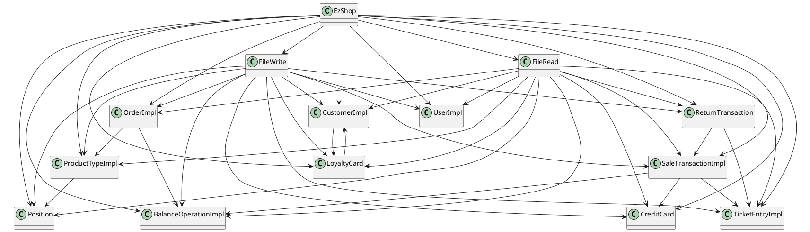

# Integration and API Test Documentation

Authors: Giuseppe Salvi, Milad Beigi Harchegani, Roberto Bosio, Naeem Ur Rehman 

Date: 26/05/2021

Version: 1.0.0

# Contents

- [Dependency graph](#dependency graph)

- [Integration approach](#integration)

- [Tests](#tests)

- [Scenarios](#scenarios)

- [Coverage of scenarios and FR](#scenario-coverage)
- [Coverage of non-functional requirements](#nfr-coverage)

# Dependency graph 

     <report the here the dependency graph of the classes in EzShop, using plantuml>

     
# Integration approach

    <Write here the integration sequence you adopted, in general terms (top down, bottom up, mixed) and as sequence
    (ex: step1: class A, step 2: class A+B, step 3: class A+B+C, etc)> 
    <Some steps may  correspond to unit testing (ex step1 in ex above), presented in other document UnitTestReport.md>
    <One step will  correspond to API testing>
    
## Integration sequence adopted : Bottom up

### step1: (Unit testing) 
classes BalanceOperationImpl + CreditCard + CustomerImpl + LoyaltyCard + OrderImpl + Position + ProductTypeImpl + ReturnTransaction + SaleTransactionImpl + TicketEntryImpl + UserImpl

### step2: 
classes BalanceOperationImpl + CreditCard + CustomerImpl + LoyaltyCard + OrderImpl + Position + ProductTypeImpl + ReturnTransaction + SaleTransactionImpl + TicketEntryImpl + UserImpl + FileRead + FileWrite

### step3: (API testing) 
classes BalanceOperationImpl + CreditCard + CustomerImpl + LoyaltyCard + OrderImpl + Position + ProductTypeImpl + ReturnTransaction + SaleTransactionImpl + TicketEntryImpl + UserImpl + FileRead + FileWrite + EZShop

#  Tests

   <define below a table for each integration step. For each integration step report the group of classes under test, and the names of
     JUnit test cases applied to them> JUnit test classes should be here src/test/java/it/polito/ezshop

## Step 1
| Classes  | JUnit test cases |
|--|--|
| BalanceOperationImpl | testGettersSettersConstructors |
| CreditCard | testCheckValidityWithInvalidString |
|| testCheckValidityWithCreditCardNotANumber |
|| testCheckValidityLuhnCheckPassed |
|| testCheckValidityLuhnCheckNotPassed |
|| testSetNumberWithInvalidString |
|| testSetNumberWithValidString |
|| testSetBalanceWithNull |
|| testSetBalanceWithValidBalance |
|| testCheckValidityForLoop0Iterations |
|| testCheckValidityForLoop1Iterations |
|| testCheckValidityForLoopMultipleIterations |
| CustomerImpl | testGettersSettersConstructors |
| LoyaltyCard | testGettersSettersConstructors |
| OrderImpl | testGettersSettersConstructors|
| Position | testSetPositionWithValidString |
|| testSetPositionWithInvalidString |
| ProductTypeImpl | testCheckBarCodeNull |
|| testCheckBarCodeWithLongString |
|| testCheckBarCodeInvalidCheckSum |
|| testCheckBarCodeValidString |
|| testGettersSettersConstructors |
|| testCheckBarCodeForLoopString12 |
|| testCheckBarCodeForLoopString13 |
|| testCheckBarCodeForLoopString14 |
| ReturnTransaction | testGettersSettersConstructors |
|| testAddEntryWithNull|
|| testAddEntryWithValidInput |
|| testDeleteEntryWithNull |
|| testDeleteEntryWithProductNotPresent |
|| testDeleteEntryWithProductPresent |
|| testDeleteEntryForLoop0Iterations |
|| testDeleteEntryForLoop1Iterations |
|| testDeleteEntryForLoopMultipleIterations |
| SaleTransactionImpl | testGettersSettersConstructors|
|| testAddEntryWithNull|
|| testAddEntryWithValidInput |
|| testDeleteEntryWithNull |
|| testDeleteEntryWithProductNotPresent |
|| testDeleteEntryWithProductPresent |
|| testDeleteEntryForLoop0Iterations |
|| testDeleteEntryForLoop1Iterations |
|| testDeleteEntryForLoopMultipleIterations |
| TicketEntryImpl | testGettersSettersConstructors | 
| UserImpl | testGettersSettersConstructors |

## Step 2
| Classes  | JUnit test cases |
|--|--|
| FileRead + FileWrite | testReadAndWriteUsers |
| | testReadWriteProducts |
| | testReadWriteOrders |
| | testReadWriteCustomers |
| | testReadWriteCards |
| | testReadWriteSales |
| | testReadWriteReturns |
| | testReadWriteOperations |
| | testReadWriteCreditCards |

## Step 3    
| Classes  | JUnit test cases |
|--|--|
|   EzShop   | testResetNominalCase | 
| | testCreateUserWithInvalidUsername |
| | testCreateUserWithInvalidPassword |
| | testCreateUserWithInvalidRole |
| | testCreateUserWithUsernameAlreadyUsed |
| | testCreateUserNominalCase |
| | testDeleteUserWithUnauthorizedUser |
| | testDeleteUserWithInvalidUserId |
| | testDeleteUserWithNonExistingUser |
| | testDeleteUserNominalCase |
| | testGetAllUsersWithUnauthorizedUser |
| | testGetAllUsersNominalCase |
| | testGetUserWithUnauthorizedUser |
| | testGetUserWithInvalidUserId |
| | testGetUserWithNonExistingUser |
| | testGetUserNominalCase |
| | testUpdateUserRightsWithUnauthorizedUser |
| | testUpdateUserRightsWithInvalidUserId |
| | testUpdateUserRightsWithInvalidRole |
| | testUpdateUserRightsWithNonExistingUser |
| | testUpdateUserRightsNominalCase |
| | testLoginWithInvalidUsername |
| | testLoginWithInvalidPassword |
| | testLoginWithNonExistingUser |
| | testLoginWithWrongCredentials |
| | testLoginNominalCase |
| | testLogoutWithNoLoggedUser |
| | testLogoutNominalCase |
| | testCreateProductTypeNominalCase |
| | testCreateProductTypeUnauthorized |
| | testCreateProductTypeInvalidProductCode |
| | testCreateProductTypeInvalidProductDescription |
| | testCreateProductTypeInvalidPrice |
| | testCreateProductTypeBarcodeAlreadyExists |
| | testUpdateProductNominalCase |
| | testUpdateProductUnauthorized |
| | testUpdateProductInvalidProductCode |
| | testUpdateProductInvalidProductDescription |
| | testUpdateProductInvalidPrice |
| | testUpdateProductInvalidId |
| | testUpdateProductProductNotExists |
| | testUpdateProductBarcodeAlreadyUsed |
| | testDeleteProductTypeNominalCase |
| | testDeleteProductTypeUnauthorized |
| | testDeleteProductTypeInvalidId |
| | testDeleteProductTypeProductNotExists |
| | testGetAllProductTypesNominalCase |
| | testGetAllProductTypesUnauthorized |
| | testGetProductTypeByBarcodeNominalCase |
| | testGetProductTypeByBarcodeUnauthorized |
| | testGetProductTypeByBarcodeInvalidBarcode |
| | testGetProductTypeByBarcodeProductNotExists |
| | testGetProductTypesByDescriptionNominalCase |
| | testGetProductTypesByDescriptionUnauthorized |
| | testGetProductTypesByDescriptionProductNotExists |
| | testGetProductTypesByDescriptionPartialMatch |
| | testGetProductTypesByDescriptionNullDescription |
| | testUpdateQuantityNominalCase |
| | testUpdateQuantityUnauthorized |
| | testUpdateQuantityInvalidID |
| | testUpdateQuantityProductNotExists |
| | testUpdateQuantityProductNegativeQuantity |
| | testUpdateQuantityProductNoLocation |
| | testUpdatePositionNominalCase |
| | testUpdatePostionUnauthorized |
| | testUpdatePositionInvalidID |
| | testUpdatePositionProductNotExists |
| | testUpdatePositionInvalidFormat |
| | testUpdatePositionNotUnique |
| | testUpdatePositionNullShouldReset |  
| | testIssueOrderNominalCase |
| | testIssueOrderUnauthorized |
| | testIssueOrderInvalidProductCode |
| | testIssueOrderInvalidQuantity |
| | testIssueOrderInvalidPricePerUnit |
| | testIssueOrderProductNotExists |
| | testPayOrderForNominalCase |
| | testPayOrderForUnauthorized |
| | testPayOrderForInvalidProductCode |
| | testPayOrderForInvalidQuantity |
| | testPayOrderForInvalidPricePerUnit |
| | testPayOrderForProductNotExists |
| | testPayOrderForBalanceNotEnough |
| | testPayOrderNominalCase |
| | testPayOrderUnauthorized |
| | testPayOrderNotExists |
| | testPayOrderInvalidOrderID |
| | testPayOrderBalanceNotEnough |
| | testPayOrderAlreadyReceived |
| | testPayOrderAlreadyPayed |
| | testRecordOrderArrivalNominalCase |
| | testRecordOrderArrivalUnauthorized |
| | testRecordOrderArrivalInvalidOrderID |
| | testRecordOrderArrivalLocationNotExists |
| | testRecordOrderArrivalAlreadyArrived |
| | testRecordOrderArrivalNotPayed |
| | testGetAllOrdersNominalCase |
| | testGetAllOrdersUnauthorized |
| | testDefineCustomerNominalCase |
| | testDefineCustomerUnauthorized |
| | testDefineCustomerInvalidName |
| | testDefineCustomerAlreadyExists |
| | testModifyCustomerNominalCase |
| | testModifyCustomerUnauthorized |
| | testModifyCustomerInvalidName |
| | testModifyCustomerInvalidID |
| | testModifyCustomerInvalidCard |
| | testModifyCustomerCustomerNotExists |
| | testModifyCustomerModifyCard |
| | testDeleteCustomerNominalCase |
| | testDeleteCustomerUnauthorized |
| | testDeleteCustomerInvalidID |
| | testDeleteCustomerCustomerNotExists |
| | testGetCustomerNominalCase |
| | testGetCustomerUnauthorized |
| | testGetCustomerInvalidID |
| | testGetCustomerCustomerNotExists |
| | testGetAllCustomersNominalCase |
| | testGetAllCustomerUnauthorized |
| | testCreateCardNominalCase |
| | testCreateCardUnauthorized |
| | testAttachCardToCustomerNominalCase |
| | testAttachCardToCustomerUnauthorized |
| | testAttachCardToCustomerInvalidID |
| | testAttachCardToCustomerInvalidCardID |
| | testAttachCardToCustomerVariousErrors |
| | testModifyPointsOnCardNominalCase |
| | testModifyPointsOnCardUnauthorized |
| | testModifyPointsOnCardInvalidCardID |
| | testModifyPointsOnCardNegativeBalance |
| | testStartSaleTransactionWithUnauthorizedUser |
| | testStartSaleTransactionNominalCase |
| | testAddProductToSaleWithUnauthorizedUser |
| | testAddProductToSaleWithQuantityLessThanZero |
| | testAddProductToSaleWithInvalidProductCode |
| | testAddProductToSaleWithInvalidTransactionId |
| | testAddProductToSaleProductCodeDoesNotExist |
| | testAddProductToSaleQuantityOfProductCannotSatisfyRequest |
| | testAddProductToSaleTransactionIdDoesNotIdentifyAnOpenTransaction |
| | testAddProductToSaleNominalScenario |
| | testDeleteProductFromSaleWithUnauthorizedUser |
| | testDeleteProductFromSaleWithQuantityLessThanZero |
| | testDeleteProductFromSaleWithInvalidProductCode |
| | testDeleteProductFromSaleWithInvalidTransactionId |
| | testDeleteProductFromSaleProductCodeDoesNotExist |
| | testDeleteProductFromSaleQuantityOfProductCannotSatisfyRequest |
| | testDeleteProductFromSaleTransactionIdDoesNotIdentifyAnOpenTransaction |
| | testDeleteProductFromSaleTransactionNominalCase |
| | testApplyDiscountRateToProductWithInvalidUser |
| | testAppyDiscountRateToProductWithInvalidDiscountRate |
| | testApplyDiscountRateToProductWithInvalidProductCode |
| | testApplyDiscountRateToProductWithInvalidTransactionId |
| | testApplyDiscountRateToProductProductCodeDoesNotExist |
| | testApplyDiscountRateToProductTransactionIsNotOpen |
| | testApplyDiscountRateToProductNominalCase |
| | testApplyDiscountRateToSaleWithInvalidUser |
| | testAppyDiscountRateToSaleWithInvalidDiscountRate |
| | testApplyDiscountRateToSaleWithInvalidTransactionId |
| | testApplyDiscountRateToSaleTransactionIsNotOpenOrClosed |
| | testApplyDiscountRateToSaleNominalCase |
| | testComputePointsForSaleWithUnauthorizedUser |
| | testComputePointsForSaleWithInvalidTransactionId |
| | testComputePointsForSaleWithNonExistingTransaction |
| | testComputePointsForSaleNominalCase |
| | testEndSaleTransactionWithUnauthorizedUser |
| | testEndSaleTransactionWithInvalidTransactionId |
| | testEndSaleTransactionWithNotOpenTransaction |
| | testEndSaleTransactionNominalCase |
| | testDeleteSaleTransactionWithUnauthorizedUser |
| | testDeleteSaleTransactionWithInvalidTransactionId |
| | testDeleteSaleTransactionWithAlreadyPayedTransaction |
| | testDeleteSaleTransactionNominalCase |
| | testGetSaleTransactionWithUnauthorizedUser |
| | testGetSaleTransactionWithInvalidTransactionId |
| | testGetSaleTransactionWithOpenTransaction |
| | testGetSaleTransactionNominalCase |
| | testStartReturnTransactionWithUnauthorizedUser |
| | testStartReturnTransactionWithInvalidTransactionID |
| | testStartReturnTransactionWithTransactionNotAvailableAndPayed |
| | testStartReturnTransactionNominalCase |
| | testReturnProductWithUnauthorizedUser |
| | testReturnProductWithInvalidTransactionID |
| | testReturnProductWithInvalidQuantity |
| | testReturnProductWithInvalidProductCode |
| | testReturnProductWhenTransactionDoesNotExist |
| | testReturnProductWhenProductToBeReturnedDoesNotExist |
| | testReturnProductWhenProductNotInTheSaleTransaction |
| | testReturnProductWhenAmountHigherThanSoldOne |
| | testReturnProductNominalCase |
| | testEndReturnTransactionWithUnauthorizedUser |
| | testEndReturnTransactionWithInvalidTransactionID |
| | testEndReturnTransactionWithNotOpenTransaction |
| | testEndReturnTransactionNominalCase |
| | testDeleteReturnTransactionWithUnauthorizedUser |
| | testDeleteReturnTransactionWithInvalidTransactionID |
| | testDeleteReturnTransactionWithNotExistingClosedReturnTransaction |
| | testDeleteReturnTransactionNominalCase |
| | testReceiveCashPaymentUnauthorizedUser |
| | testReceiveCashPaymentInvalidCashAmount |
| | testReceiveCashPaymentInvalidTransactionId |
| | testReceiveCashPaymentWithNotOpenSaleTransaction |
| | testReceiveCashPaymentNotEnoughCash |
| | testReceiveCashPaymentNominalCase |
| | testReceiveCreditCardPaymentWithUnauthorizedUser |
| | testReceiveCreditCardPaymentInvalidCard |
| | testReceiveCreditCardPaymentInvalidSaleId |
| | testReceiveCreditCardPaymentWithNotRegisteredCreditCard |
| | testReceiveCreditCardPaymentWithNotOpenSaleTransaction |
| | testReceiveCreditCardPaymentWithNotEnoughMoneyInCard |
| | testReceiveCreditCardPaymentNominalCase |
| | testReturnCashPaymentWithUnauthorizedUser |
| | testReturnCashPaymentInvalidReturnId |
| | testReturnCashPaymentWithNotOpenReturnTransaction |
| | testReturnCashPaymentNominalCase |
| | testReturnCreditCardPaymentWithUnauthorizedUser |
| | testReturnCreditCardPaymentInvalidReturnId |
| | testReturnCreditCardPaymentWithInvalidCreditCard |
| | testReturnCreditCardPaymentWithNotOpenReturnTransaction |
| | testReturnCreditCardPaymentWithNotRegisteredCreditCard |
| | testReturnCreditCardPaymentNominalCase |
| | testRecordBalanceUpdateUnauthorizedUser |
| | testRecordBalanceUpdateInvalidAmountToBeAdded |
| | testRecordBalanceUpdateNominalCase |
| | testGetCreditsAndDebitsUnauthorizedUser |
| | testGetCreditsAndDebitsWithNullDates |
| | testGetCreditsAndDebitsReversedDate |
| | testGetCreditsAndDebitsNominalCase |
| | testComputeBalanceUnauthorizedUser |
| | testComputeBalanceNominalCase |

# Scenarios

<If needed, define here additional scenarios for the application. Scenarios should be named
 referring the UC in the OfficialRequirements that they detail>

## Scenario UCx.y

| Scenario |  name |
| ------------- |:-------------:| 
|  Precondition     |  |
|  Post condition     |   |
| Step#        | Description  |
|  1     |  ... |  
|  2     |  ... |

##### Scenario 3.4
| Scenario |  Order of product type X, balance not enough |
| ------------- |:-------------:| 
|  Precondition     | ShopManager S exists and is logged in |
| | Product type X exists |
| | Order O exists | 
|  Post condition     | Order O does not change  |
| | X.units not changed |
| | Balance not changed |
| Step#        | Description  |
|  1    |  S search for Order O |  
|  2    |  S register payment done for O |
|  3    |  Error: balance not enough |

# Coverage of Scenarios and FR

<Report in the following table the coverage of  scenarios (from official requirements and from above) vs FR. 
Report also for each of the scenarios the (one or more) API JUnit tests that cover it. >

| Scenario ID | Functional Requirements covered | JUnit  Test(s) | 
| ----------- | ------------------------------- | ----------- | 
| 1-1 | FR3 | testCreateProductTypeNominalCase    testUpdatePositionNominalCase |
| 1-2 | FR3 | testUpdatePositionNominalCase |
| 1-3 | FR3 | testUpdateProductNominalCase | 
| 2-1 | FR1 | testCreateUserNominalCase |
| 2-2 | FR1 | testDeleteUserNominalCase | 
| 2-3 | FR1 | testUpdateUserRightsNominalCase | 
| 3-1 | FR4 | testIssueOrderNominalCase|             
| 3-2 | FR4 | testPayOrderNominalCase|             
| 3-3 | FR4 | testRecordOrderArrivalNominalCase | 
| 3-4 | FR4 | testPayOrderBalanceNotEnough |  
| 4-1 | FR5 | testDefineCustomerNominalCase|             
| 4-2 | FR5 | testAttachCardToCustomerNominalCase  testModifyCustomerNominalCase|             
| 4-3 | FR5 | testModifyCustomerModifyCard |             
| 4-4 | FR5 | testModifyCustomerNominalCase|  
| 5-1 | FR1 | testLoginNominalCase |
| 5-2 | FR1 | testLogoutNominalCase |
| 6-1 | FR6,7 | testReceiveCreditCardPaymentNominalCase |
| 6-2 | FR6 | testApplyDiscountRateToProductNominalCase | 
| 6-3 | FR6 | testApplyDiscountRateToSaleNominalCase |
| 6-4 | FR6 | testComputePointsForSaleNominalCase   testModifyPointsOnCardNominalCase |
| 6-5 | FR6 | testDeleteSaleTransactionNominalCase | Sale of product type X cancelled
| 6-6 | FR6,7 | testReceiveCashPaymentNominalCase |
| 7-1 | FR6,7 | testReceiveCreditCardPaymentNominalCase |
| 7-2 | FR6,7 | testReceiveCreditCardPaymentInvalidCard |
| 7-3 | FR6,7 | testReceiveCreditCardPaymentWithNotEnoughMoneyInCard |
| 7-4 | FR6,7 | testReceiveCashPaymentNominalCase |
| 8-1 | FR6,7 | testReturnCreditCardPaymentNominalCase |
| 8-2 | FR6,7 | testReturnCashPaymentNominalCase |
| 9-1 | FR8 | testGetCreditsAndDebitsNominalCase |
| 10-1 | FR6,7 | testReturnCreditCardPaymentNominalCase |
| 10-2 | FR6,7 | testReturnCashPaymentNominalCase |

# Coverage of Non Functional Requirements

<Report in the following table the coverage of the Non Functional Requirements of the application - only those that can be tested with automated testing frameworks.>

| Non Functional Requirement | Test name |
| -------------------------- | --------- |
| NRF4 | testCreateProductTypeNominalCase |
| NFR5 | testReturnCreditCardPaymentNominalCase, testReceiveCreditCardPaymentNominalCase |
| NRF6 | testCreateCardNominalCase |

###

